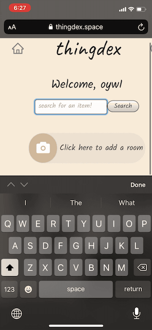

# Thingdex

배포 주소: [www.thingdex.space](www.thingdex.space)

## Preview

### Overview


### Predict


### Search



## Requirements

- Chrome Browser를 권장합니다.

- Google, Facebook, Twitter, 혹은 Github OAuth ID 와 Secret Key 발급이 선행되어야 합니다.

- MongoDB 가입 후 데이터베이스 ID 와 Password 설정이 선행되어야 합니다.

- AWS Access Key ID 및 Secret Key 발급이 선행되어야 합니다.

  

## Prerequisites

- Node.js 설치

## Installation

### Client

```
git clone https://github.com/imhojang/thingdex-client.git
cd thingdex-client
npm install
npm start
```

### Server

```
git clone https://github.com/imhojang/thingdex-server.git
cd thingdex-server
npm install
npm start
```

thingdex-server의 root 폴더 안에 '.dotenv' 파일명으로 작성한 파일 안에 아래의 ** **안 작성

```
DB_USER=**MongoDB userID**
DB_PASS=**MongoDB password**
SESSION_SECRET=**this can be any connected string**
GOOGLE_CLIENT_ID=**Google API OAuth Client ID**
GOOGLE_CLIENT_SECRET=**GOogle API OAuth Client Secret**
FACEBOOK_CLIENT_ID=**Facebook API OAuth Client ID**
FACEBOOK_CLIENT_SECRET=**Facebook API OAuth Client Seceret**
GITHUB_CLIENT_ID=**Github API OAuth Client ID**
GITHUB_CLIENT_SECRET=**Github API OAuth Client Secret**
TWITTER_CLIENT_ID=**Twitter API OAuth Client ID**
TWITTER_CLIENT_SECRET=**Twitter API OAuth Client Secret**
AWS_SECRET_KEY=**AWS API Secret Key**
AWS_ACCESS_KEY_ID=**AWS API Access Key ID**
AWS_REGION=**AWS region**
```


## Features

- Tensorflow의 Object Detection 모델을 이용하여 사진 속 사물을 자동으로 인식합니다.
- 인식된 사물은 후에 저장시 등록된 이름을 통해 저장시 사물이 있는 위치 검색이 가능합니다.
- 방(Room) 안에 사물들이 있는 위치(Location)들을 기록하는 스트럭쳐입니다.
- 방과 위치는 사용자가 직접 삭제할 수 있습니다.
- 위치에 담긴 사물 등록 전 Object Detection 오작동 시에 사물 Input Field 추가/삭제 기능


## Client-Side

- Babel을 통한 모던 자바스크립트 (ES2015+)
- Google, Facebook, Github, Twitter OAuth 인증 및 Passport Local 인증을 통한 회원가입 및 로그인 구현
- React Redux와 Redux Thunk를 이용한 예측 가능한 상태 관리
- React를 사용한 컴포넌트 베이스 UI 아키텍처 구현
- HTTP Client fetch API를 통한 GET & POST & DELETE HTTP 요청
- CSS Prepropcessor Sass(SCSS)를 이용한 CSS 작성


## Server-Side

- Babel을 통한 모던 자바스크립트 (ES2015+)
- Node와 Express를 통한 API 서버 구현
- MongoDB Atlas와 Mongoose를 이용한 사용자 및 사운드 데이터 관리
- AWS S3와 Multer를 이용한 이미지 파일 업로드 및 관리
- Moment를 이용한 업로드 시간 변환 
- Dotenv를 통한 환경변수 관리


## Continuous Integration

- 소스관리/빌드/테스트/배포의 지속적인 통합을 위한 CircleCI (Server)
- Netlify CI (Client)


## Deployment

- AWS Elastic Beanstalk (Server)
- Netlify (Client)


## Project Control

- Adobe XD을 통한 application view flow 설계 및 디자인
- Trello를 이용한 기획 및 일정과 task 관리
- Git을 이용한 version control
- 클라이언트와 서버의 독립적인 관리를 위한 각각의 Github 저장소

---


## Things to do

### 1. Etc

- Component Unit Test
- Server API Unit Test
- E2E Test
- Integration Test
- Code Refactoring